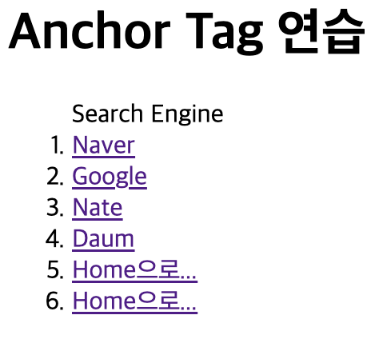
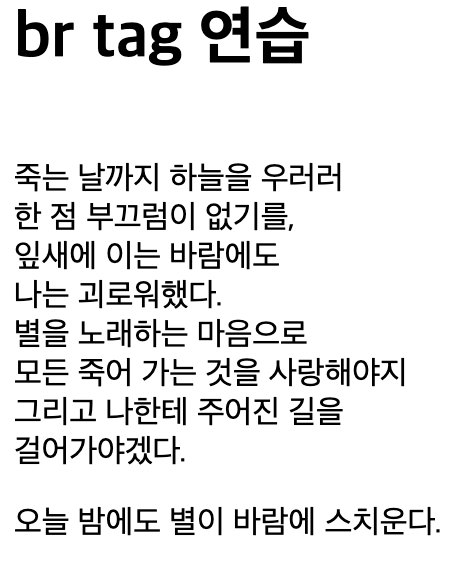
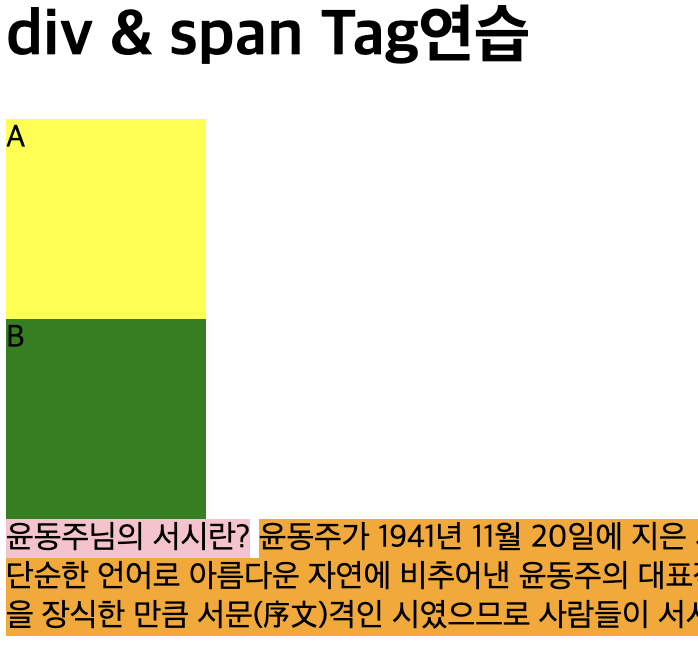
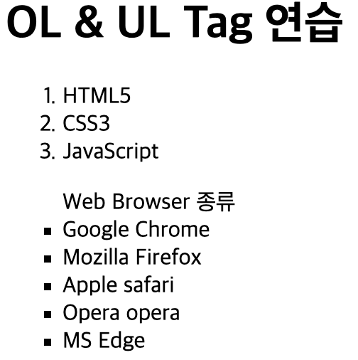

# 8월 5일 HTML5 수업

## Anchor Tag

설명: 절대 경로와 상대 경로로 링크를 설정하여 다양한 웹 페이지로 이동하는 방법 `target` 속성을 사용하여 링크를 새로운 창, 동일 창 등에서 여는 방식

```html
<body>
  <h1>Anchor Tag</h1>
  <ol>Search Engine
    <li><a href="https://www.naver.com">Naver</a></li>
    <li><a href="https://www.google.com" target="_blank">Google</a></li>
    <li><a href="https://www.Nate.com" target="_self">Nate</a></li>
    <li><a href="https://www.daum.net">Daum</a></li>
    <li><a href="../index.html">Home으로...</a></li>
    <li><a href="/index.html">Home으로...</a></li>
  </ol>
</body>
```

**출력 결과**:

[//]: # (![Anchor Tag]&#40;../assets/img/0805/0805-1.png&#41;)


## br Tag

설명: `<br>` 태그를 사용하여 텍스트 줄바꿈 예제를 통해 줄바꿈 확인

```html
<body>
  <h1>br Tag</h1>
  <br>
    죽는 날까지 하늘을 우러러<br />한 점 부끄럼이 없기를,<br />잎새에 이는 바람에도<br />
    나는 괴로워했다.<br />별을 노래하는 마음으로<br />모든 죽어 가는 것을 사랑해야지<br />
    그리고 나한테 주어진 길을<br />
    걸어가야겠다.<br />
  <p>
    오늘 밤에도 별이 바람에 스치운다.
  </p>
</body>
```

**출력 결과**:

[//]: # (![br Tag 연습]&#40;../assets/img/0805/0805-2.png&#41;)


## div & span Tag

설명: `<div>`와 `<span>` 태그를 사용하여 블록과 인라인 요소를 구분, 스타일 속성을 사용하여 배경색과 크기를 설정

```html
<body>
  <h1>div & span Tag</h1>
  <div style="width:100px;height: 100px; background-color: yellow;">A</div>
  <div style="width:100px;height: 100px; background-color: green;">B</div>
  <span style="width:100px;height: 100px; background-color: pink;">윤동주님의 서시란?</span>
  <span style="width:100px;height: 100 px; background-color: orange;">윤동주가 1941년 11월 20일에 지은 시로...</span>
</body>
```

**출력 결과**:

[//]: # (![div & span Tag 연습]&#40;../assets/img/0805/0805-3.png&#41;)


## DL Tag

설명: `<dl>`, `<dt>`, `<dd>` 태그를 사용하여 정의 리스트를 작성하는 방법을 설명합니다.

```html
<body>
  <dl>
    <dt>윤동주님의 서시란?</dt>
    <dd>
      윤동주가 1941년 11월 20일에 지은 시로, 그의 유고(遺稿) 시집인 『하늘과 바람과 별과 시』에 수록된 작품이다.
    </dd>
  </dl>
</body>
```

**출력 결과**:

[//]: # (![DL Tag 연습]&#40;../assets/img/0805/0805-4.png&#41;)


## OL & UL Tag

설명: `<ol>`과 `<ul>` 태그를 사용하여 순서가 있는 목록과 순서가 없는 목록을 작성하는 방법

```html
<body>
  <h1>OL & UL Tag</h1>
  <ol>
    <li>HTML5</li>
    <li>CSS3</li>
    <li>JavaScript</li>
  </ol>
  <ul type="square">Web Browser 종류
    <li>Google Chrome</li>
    <li>Mozilla Firefox</li>
    <li>Apple Safari</li>
    <li>Opera Opera</li>
    <li>MS Edge</li>
  </ul>
</body>
```

**출력 결과**:

[//]: # (![OL & UL Tag 연습]&#40;../assets/img/0805/0805-5.png&#41;)

