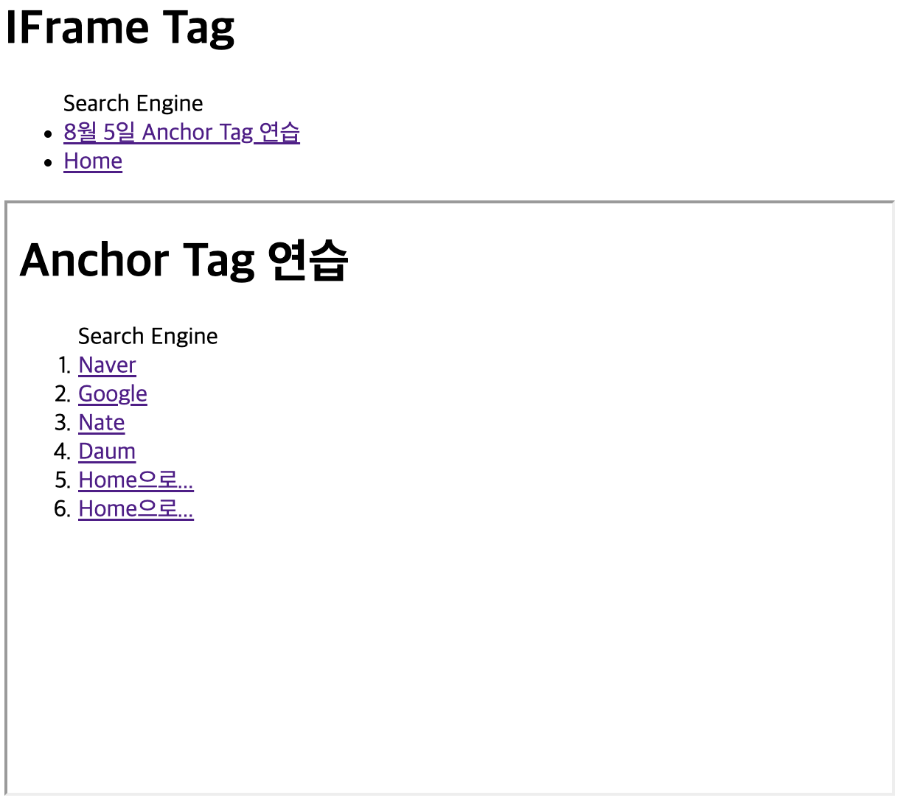
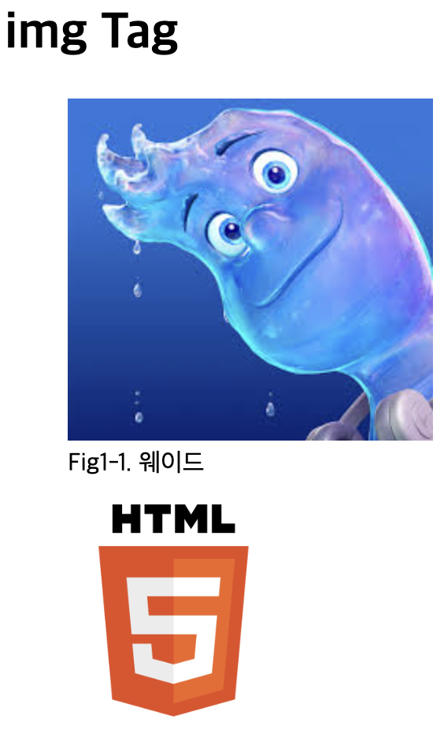
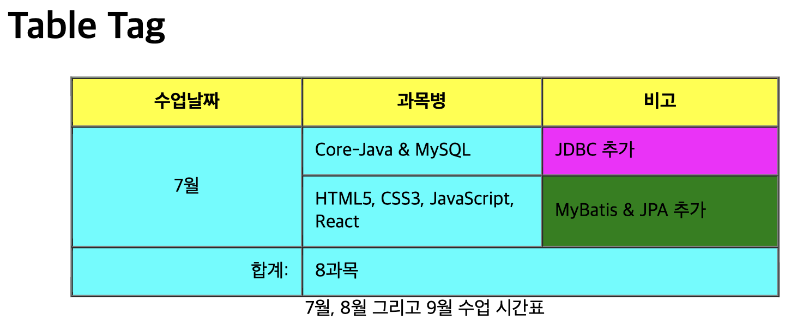

# 8월 6일 수업

## Form Tag

설명 : 폼 태그를 이용하여 기본 정보와 비즈니스 정보를 입력받는 폼을 구성한 예제

```html
<body>
  <h1>Form Tag</h1>
  <form>
    <fieldset style="width:650px;">
      <legend>Basic Info</legend>
      <p>
        <label for="username">Name : </label>
        <input type="text" size="5" id="username" value="value" required>
      </p>
      <p>
        <label for="userage">Age : </label>
        <input type="number" id="userage" max="60" value="30" readonly>
      </p>
      <p>
        <label for="usergender">Gender : </label>
        <input type="radio" name="gender" value="male">남성&nbsp;&nbsp;
        <input type="radio" name="gender" value="female">여성
      </p>
    </fieldset>
    <fieldset style="width: 650px;">
      <legend>Business Info</legend>
      <p>
        <label for="userid">ID : </label>
        <input type="text" size="20" maxlength="12" id="userid" placeholder="Enter Your ID" required/>
      </p>
      <p>
        <label for="userpwd">Password : </label>
        <input type="password" size="20" maxlength="8" id="userpwd" required/>
      </p>
      <p>
        <label for="usertel">Telephone : </label>
        <select>
          <option>--선택--</option>
          <option value="010" selected>010</option>
          <option value="011">011</option>
          <option value="016">016</option>
          <option value="018">018</option>
          <option value="019">019</option>
        </select>
        <input type="tel" size="15" id="usertel" disabled/>
      </p>
      <p>
        <label for="">Your Favorite Browser : </label>
        <input type="text" list="browser">
        <datalist id="browser">
          <option value="chrome">Google Chrome</option>
          <option value="firefox">Mozilla Firefox</option>
          <option value="safari">Apple Safari</option>
          <option value="opera">Opera</option>
          <option value="edge">Microsoft Edge</option>
        </datalist>
      </p>
      <p>
        <label for="">지원 날짜 : </label>
        <input type="datetime-local">
      </p>
      <p>
        <label for="">사진 : </label>
        <input type="file">
      </p>
      <p>
        <label for="">Available Language : </label>
        <input type="checkbox" name="lang" value="C-lang">C-language&nbsp;
        <input type="checkbox" name="lang" value="Java" checked>Java&nbsp;
        <input type="checkbox" name="lang" value="Python">Python&nbsp;
        <input type="checkbox" name="lang" value="JavaScript">JavaScript&nbsp;
        <input type="checkbox" name="lang" value="React">React&nbsp;
        <input type="checkbox" name="lang" value="C#">C#
      </p>
    </fieldset>
    <p>
      <label for="">지원동기 : </label>
      <textarea name="" id="" rows="5" cols="40" placeholder="1000자 이내로 입력하세요."></textarea>
    </p>
    <p>
      <input type="submit" value="전송">&nbsp;&nbsp;&nbsp;
      <button type="reset">취소</button>
    </p>
  </form>
</body>
```
**출력 결과**:


### 구성 요소

1. **기본 정보 (Basic Info)**
  - **이름 (Name)**: 텍스트 입력 필드, 초기값은 "value값"으로 설정되며 필수 입력 사항
  - **나이 (Age)**: 숫자 입력 필드, 최대값은 60, 초기값은 30이며 읽기 전용(readonly)
  - **성별 (Gender)**: 라디오 버튼을 이용하여 남성 또는 여성을 선택할 수 있다.

2. **비즈니스 정보 (Business Info)**
  - **ID**: 텍스트 입력 필드, 최대 길이는 12자이며 필수 입력 사항
  - **비밀번호 (Password)**: 비밀번호 입력 필드, 최대 길이는 8자이며 필수 입력 사항
  - **전화번호 (Telephone)**: 드롭다운 메뉴와 비활성화된 텍스트 입력 필드를 포함한다.
  - **선호 브라우저 (Your Favorite Browser)**: 데이터 리스트를 이용하여 선호하는 브라우저를 선택할 수 있다.
  - **지원 날짜**: 날짜 및 시간을 선택할 수 있는 입력 필드
  - **사진**: 파일 업로드 입력 필드
  - **사용 가능한 언어 (Available Language)**: 체크박스를 이용하여 여러 프로그래밍 언어를 선택할 수 있다.

3. **지원 동기 (지원동기)**
  - **지원 동기**: 텍스트 영역을 이용하여 지원 동기를 입력할 수 있다. 1000자 이내로 입력해야 한다.

4. **제출 및 취소**
  - **전송**: 폼을 제출하는 버튼
  - **취소**: 폼을 초기화하는 버튼

## IFrame Tag

설명 : `<iframe>` 태그를 이용하여 다른 웹페이지를 현재 페이지에 삽입할 수 있는 방식

```html
<body>
  <h1>IFrame Tag</h1>
  <ul>Search Engine
    <li><a href="../0805/a.html" target="myframe">8월 5일 Anchor Tag 연습</a></li>
    <li><a href="/" target="myframe">Home</a></li>
  </ul>
  <div>
    <iframe src="" name="myframe" width="600" height="400"></iframe>
  </div>
</body>
```

**출력 결과**:



### 구성 요소

1. **IFrame Tag (IFrame 태그)**
  - `<iframe>` 태그는 다른 HTML 문서를 현재 페이지 내에 삽입할 수 있게 해준다.
  - `src` 속성은 기본적으로 로드될 문서의 URL을 지정한다. 현재는 빈 문자열로 설정되어 있다.
  - `name` 속성은 이 프레임의 이름을 지정하며, 링크의 `target` 속성과 연결된다.
  - `width`와 `height` 속성은 IFrame의 크기를 지정한다. 여기서는 각각 600픽셀과 400픽셀로 설정되어 있다.

2. **Anchor Tags (앵커 태그)**
  - `<a>` 태그는 다른 페이지로의 하이퍼링크를 생성한다.
  - `href` 속성은 링크될 페이지의 URL을 지정한다.
  - `target` 속성은 링크를 클릭했을 때 열릴 위치를 지정한다. 여기서는 `"myframe"`으로 설정되어, IFrame 내부에 링크된 페이지가 열리게 된다.

3. **Unordered List (비정렬 목록)**
  - `<ul>` 태그는 비정렬 목록을 생성한다.
  - `<li>` 태그는 목록 항목을 나타낸다.
  - "Search Engine" 목록에는 두 개의 항목이 포함되어 있으며, 각각 다른 페이지로 링크된다.


## img Tag

설명 : `` 태그를 이용하여 이미지를 삽입하고 설명을 추가한다.

```html
<body>
  <h1>img Tag</h1>
  <div>
    <figure>
      <br />
      <figcaption>Fig1-1. 웨이드</figcaption>
    </figure>
  </div>
  <div>
    <figure>
      
    </figure>
  </div>
</body>
```
**출력 결과**:



### 구성 요소

1. **첫 번째 이미지 섹션**
   - `<figure>` 태그는 이미지와 그에 대한 설명을 묶어준다.
   - `` 태그는 실제 이미지를 삽입한다.
     - `src` 속성: 이미지 파일의 경로를 지정. 위의 코드 블록에서는 `"images/123.jpeg"`
     - `alt` 속성: 이미지가 로드되지 않을 때 대체 텍스트를 제공. 위의 코드 블록에서는 "웨이드 이미지"
   - `<figcaption>` 태그: 이미지에 대한 설명을 추가. 위의 코드 블록에서는 "Fig1-1. 웨이드"

2. **두 번째 이미지 섹션**
   - 또 다른 `<figure>` 태그는 다른 이미지를 삽입한다.
   - `src` 속성: 이미지 파일의 URL을 지정합니다. 여기서는 HTML5 로고 이미지
   - `alt` 속성: "HTML5 logo"로 설정되어 있다.

## Table Tag

설명 : <table> 태그를 이용하여 테이블을 생성하는 예제

```html
<body>
  <h1>Table Tag</h1>
  <table align="center" width="600" cellspacing="0" border="1" cellpadding="10">
    <colgroup>
      <col span="2" style="background-color: aqua;" />
      <col style="background-color: magenta;" />
    </colgroup>
    <caption align="bottom">7월, 8월 그리고 9월 수업 시간표</caption>
    <thead>
      <tr style="background-color: yellow; height: 100;">
        <th width="200">수업날짜</th>
        <th width="200">과목명</th>
        <th width="200">비고</th>
      </tr>
    </thead>
    <tbody>
      <tr>
        <td align="center" rowspan="3">7월</td>
        <td>Core-Java & MySQL</td>
        <td rowspan="2">JDBC 추가</td>
      </tr>
      <tr>
        <td rowspan="2">HTML5, CSS3, JavaScript, React</td>
      </tr>
      <tr>
        <td bgcolor="green">MyBatis & JPA 추가</td>
      </tr>
    </tbody>
    <tfoot>
      <td align="right">합계:</td>
      <td colspan="2">8과목</td>
    </tfoot>
  </table>
</body>
```
**출력 결과**:



### 구성 요소

1. **테이블 설정**
   - `<table>` 태그는 테이블을 생성합니다.
     - `align`: 테이블의 정렬을 지정한다. 위의 코드 블록에서는 `"center"`로 설정되어 있다.
     - `width`: 테이블의 너비를 지정한다. 위의 코드 블록에서는 `600`으로 설정되어 있다.
     - `cellspacing`: 셀 간의 간격을 지정한다. 여기서는 `0`으로 설정되어 있다.
     - `border`: 테이블 테두리의 너비를 지정한다. 여기서는 `1`로 설정되어 있다.
     - `cellpadding`: 셀 안쪽 여백을 지정한다. 여기서는 `10`으로 설정되어 있다.

2. **colgroup**
   - `<colgroup>` 태그는 열 그룹을 지정한다.
   - `<col>` 태그는 각 열의 스타일을 지정한다.
     - 첫 두 열은 배경색이 aqua로 설정되어 있다.
     - 세 번째 열은 배경색이 magenta로 설정되어 있다.

3. **caption**
   - `<caption>` 태그는 테이블의 제목을 지정. 위의 코드 블록에서는 "7월, 8월 그리고 9월 수업 시간표"로 설정되어 있다.

4. **thead**
   - `<thead>` 태그는 테이블 헤더를 정의한다.
   - 헤더 행은 배경색이 yellow이고 높이가 100으로 설정되어 있다.
   - 각 헤더 셀은 "수업날짜", "과목명", "비고"로 설정되어 있다.

5. **tbody**
   - `<tbody>` 태그는 테이블 본문을 정의한다.
   - 여러 행을 포함하며, 일부 셀은 병합되어 있다 (예: `rowspan` 속성).

6. **tfoot**
   - `<tfoot>` 태그는 테이블 푸터를 정의한다.
   - 마지막 행은 "합계"와 "8과목"으로 설정되어 있다.
